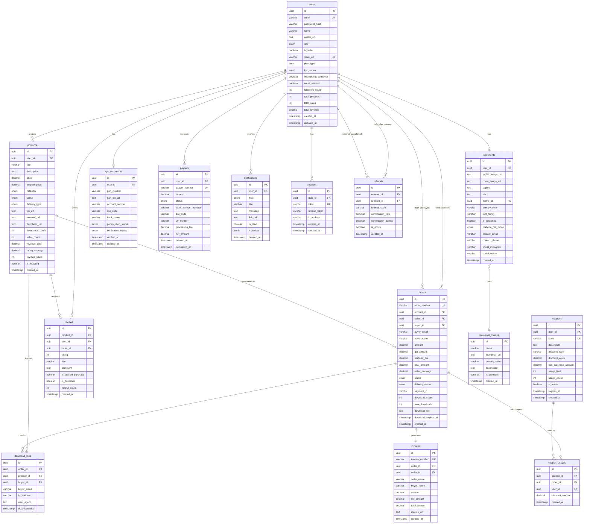
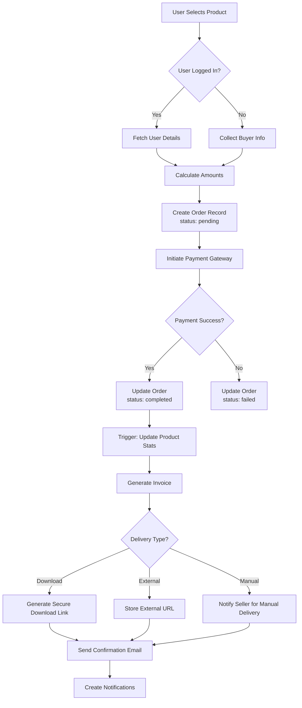
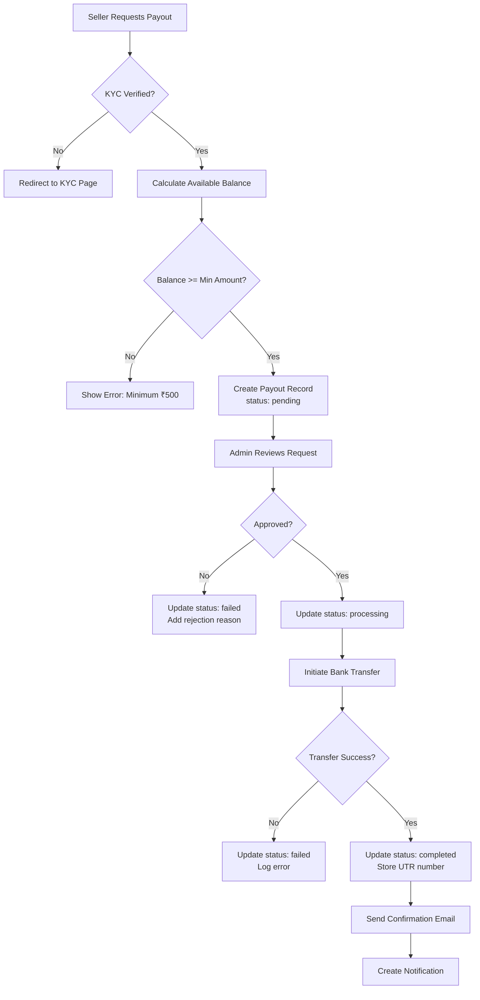
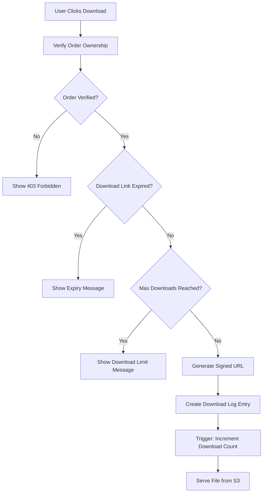
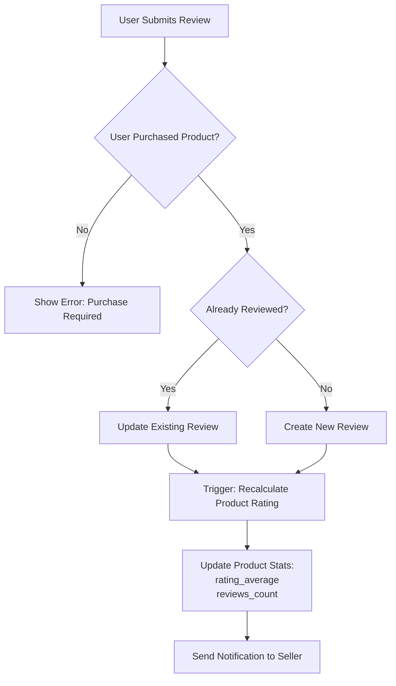
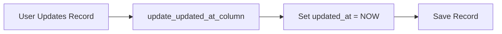
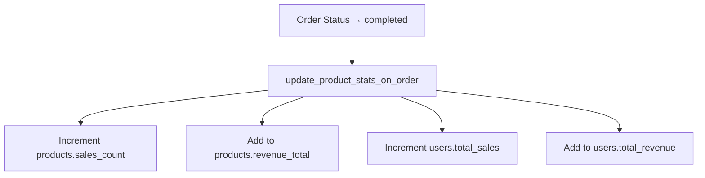
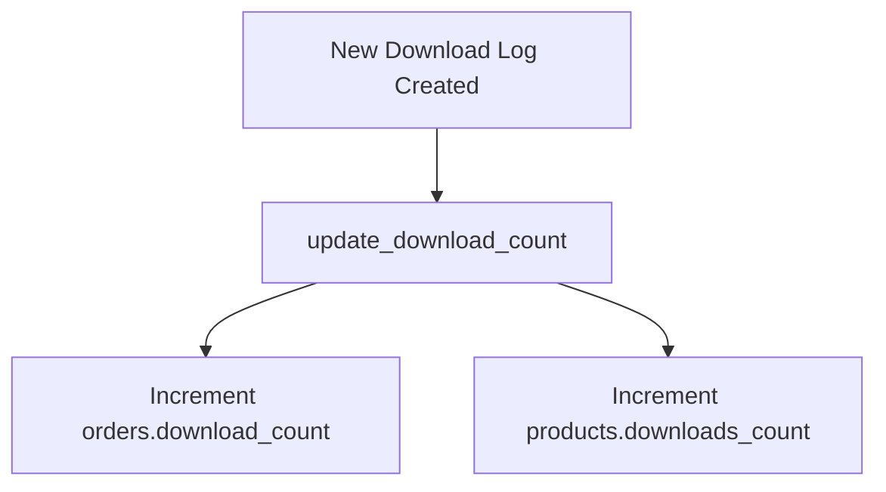
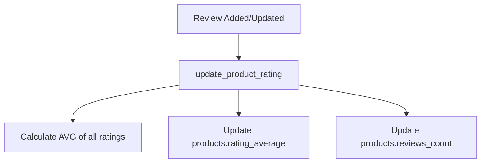

# GenZaic Creator Hub - Entity Relationship Diagram

## Database Schema Visualization

This document provides a visual representation of the database schema using Mermaid diagrams.

---

## Core Entity Relationships



---

## Table Relationships Summary

### One-to-One Relationships

| Parent | Child | Description |
|--------|-------|-------------|
| users | storefronts | Each seller has one storefront |
| users | kyc_documents | Each user has one KYC record |
| orders | invoices | Each order generates one invoice |

### One-to-Many Relationships

| Parent | Child | Description |
|--------|-------|-------------|
| users | products | Seller creates many products |
| users | orders (seller) | Seller receives many orders |
| users | orders (buyer) | Buyer places many orders |
| users | payouts | User requests many payouts |
| users | reviews | User writes many reviews |
| users | notifications | User receives many notifications |
| users | sessions | User has many sessions |
| products | orders | Product sold in many orders |
| products | reviews | Product has many reviews |
| products | download_logs | Product tracked in many downloads |
| orders | download_logs | Order has many downloads |
| coupons | coupon_usages | Coupon used many times |

### Many-to-One Relationships

| Child | Parent | Description |
|-------|--------|-------------|
| storefronts | storefront_themes | Many storefronts use one theme |
| coupon_usages | orders | Many coupon usages for different orders |

---

## Data Flow Diagrams

### Order Creation Flow



### Payout Request Flow



### Download Flow



### Review Submission Flow



---

## Key Database Triggers

### 1. Auto-Update Timestamps



**Applies to:** users, storefronts, products, orders, kyc_documents, reviews, sessions

---

### 2. Update Product Stats on Order



---

### 3. Track Downloads



---

### 4. Update Product Rating



---

## Database Indexes Strategy

### Users Table
```
Primary: id (UUID)
Unique: email, store_url
Indexes: role, created_at
```

### Products Table
```
Primary: id (UUID)
Foreign: user_id
Indexes: status, category, created_at, price, sales_count, rating_average
Partial Index: is_featured (WHERE is_featured = TRUE)
```

### Orders Table
```
Primary: id (UUID)
Unique: order_number
Foreign: product_id, seller_id, buyer_id
Indexes: buyer_email, status, created_at, payment_id
```

### Performance Considerations
- All foreign keys are automatically indexed
- Timestamp columns used for sorting are indexed DESC
- Boolean flags used in WHERE clauses have partial indexes
- Composite indexes can be added for specific query patterns

---

## Views for Reporting

### seller_dashboard_stats View

```sql
SELECT
  user_id,
  total_products,
  total_orders,
  total_revenue,
  revenue_last_30_days,
  orders_last_7_days
FROM seller_dashboard_stats
WHERE user_id = '...';
```

### product_analytics View

```sql
SELECT
  id,
  title,
  sales_count,
  revenue_total,
  conversion_rate,
  rating_average
FROM product_analytics
WHERE user_id = '...'
ORDER BY conversion_rate DESC;
```

---

## Enums Reference

| Enum Type | Values |
|-----------|--------|
| user_role | buyer, seller, admin |
| kyc_status | not_submitted, pending, verified, rejected |
| plan_type | creator, startup, enterprise |
| product_status | draft, published, archived |
| product_category | ebook, template, app, course, graphics, audio, other |
| delivery_type | download, external_link, manual |
| order_status | pending, completed, refunded, failed |
| delivery_status | pending, delivered |
| payout_status | pending, processing, completed, failed |
| platform_fee_mode | seller, buyer |
| notification_type | order, payout, kyc, system, product |

---

## Important Constraints

### Check Constraints

```sql
-- Products
price >= 0
rating_average >= 0 AND rating_average <= 5

-- Payouts
amount > 0

-- Reviews
rating >= 1 AND rating <= 5

-- Coupons
discount_value > 0
discount_type IN ('percentage', 'fixed')
```

### Unique Constraints

```sql
-- Users
UNIQUE(email)
UNIQUE(store_url)

-- Products
None (one seller can have products with same title)

-- Orders
UNIQUE(order_number)

-- Reviews
UNIQUE(product_id, user_id, order_id)
```

---

## Data Retention Policy

| Table | Retention | Notes |
|-------|-----------|-------|
| users | Permanent | Soft delete (is_active = false) |
| products | Permanent | Archive (status = 'archived') |
| orders | Permanent | Required for tax compliance |
| invoices | 7 years | Indian tax law requirement |
| download_logs | 1 year | For analytics and audit |
| sessions | 30 days | Auto-cleanup expired sessions |
| notifications | 90 days | Archive old notifications |
| activity_logs | 1 year | For security audit |

---

## Security Considerations

### Sensitive Data

| Field | Protection |
|-------|------------|
| users.password_hash | Bcrypt with salt >= 10 |
| kyc_documents.aadhaar_number | AES-256 encryption |
| kyc_documents.account_number | Masked in logs |
| sessions.token | SHA-256 hash |
| orders.payment_signature | Never logged |

### Access Control

```sql
-- Example: Seller can only access their own data
SELECT * FROM products
WHERE user_id = current_user_id;

-- Example: Buyer can only access their own orders
SELECT * FROM orders
WHERE buyer_id = current_user_id;
```

---

## Monitoring Queries

### Find Slow Queries

```sql
SELECT pid, now() - pg_stat_activity.query_start AS duration, query
FROM pg_stat_activity
WHERE state = 'active'
ORDER BY duration DESC;
```

### Check Table Sizes

```sql
SELECT
  schemaname,
  tablename,
  pg_size_pretty(pg_total_relation_size(schemaname||'.'||tablename)) AS size
FROM pg_tables
WHERE schemaname = 'public'
ORDER BY pg_total_relation_size(schemaname||'.'||tablename) DESC;
```

### Index Usage

```sql
SELECT
  schemaname,
  tablename,
  indexname,
  idx_scan,
  idx_tup_read,
  idx_tup_fetch
FROM pg_stat_user_indexes
ORDER BY idx_scan DESC;
```

---

**Diagram Version:** 1.0.0
**Last Updated:** 2025-12-30
**Compatible with:** PostgreSQL 14+
